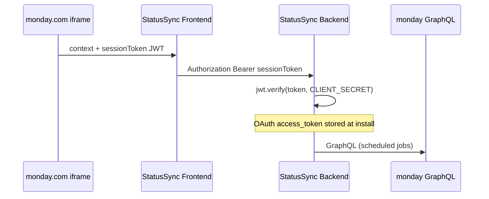

# StatusSync Frontend

React board-view app for **StatusSync** — configure scheduled monday.com board digest emails for external stakeholders.

Pairs with [StatusSync-Backend](../StatusSync-Backend).

## Stack

| Tool | Purpose |
|------|---------|
| Vite + React 19 + TypeScript | UI |
| Tailwind CSS v4 | Styling |
| TanStack Query | Server state |
| React Router | Routing |
| **monday-sdk-js** | Board view context + `sessionToken` |
| Axios | API → backend with session auth |

## Getting started

### 1. Backend

```bash
cd ../StatusSync-Backend
cp .env.example .env
# Fill MONDAY_CLIENT_ID, MONDAY_CLIENT_SECRET, MONDAY_SIGNING_SECRET
npm install
npm run dev
```

### 2. Frontend

```bash
npm install
cp .env.example .env
npm run dev
```

- App: http://localhost:5173  
- API proxy: `/api` → http://localhost:3000  

### 3. monday.com Developer Center

1. Create app → **OAuth & Permissions** (scopes: `boards:read`, `boards:write`, `account:read`, `users:read`)
2. Redirect URL: `http://localhost:3000/api/auth/monday/callback`
3. **Board View** feature → External hosting URL:
   - Local: `mapps tunnel:create` (see below)
   - Or: `npm run dev` + tunnel to port 5173
4. Install app on account: open `http://localhost:3000/api/auth/monday`

### 4. Local tunnel (recommended)

```bash
npm i -g @mondaycom/apps-cli
mapps init -t YOUR_MONDAY_API_TOKEN
mapps tunnel:create -p 5173
```

Paste tunnel URL into Board View feature in Developer Center.

## Environment

| Variable | Description |
|----------|-------------|
| `VITE_API_URL` | API base with `/api` (default `/api` uses Vite proxy) |
| `VITE_MONDAY_DEV_MODE` | Hints when not in monday iframe |

**Never** put `MONDAY_CLIENT_SECRET` in frontend env vars.

## Auth flow



- **sessionToken**: per page load, frontend → backend on every API call  
- **OAuth access_token**: stored on backend at install; used for cron/scheduled sends  

## Project structure

```
src/
├── api/                 # REST clients (digests, …)
├── app/
│   ├── providers/       # Monday + React Query
│   └── router/
├── components/layout/
├── config/env.ts
├── features/monday/     # MondayProvider, types
├── hooks/               # useDigests, …
├── lib/
│   ├── monday/          # SDK singleton, session store
│   └── api.ts           # Axios + auth interceptor
├── pages/
└── types/
```

## Scripts

- `npm run dev` — Vite dev server
- `npm run build` — production build
- `npm run lint` — ESLint

## Routes

| Path | Page |
|------|------|
| `/` | Overview |
| `/digests` | Digest list (requires monday session) |
| `/analytics` | Analytics placeholder |
